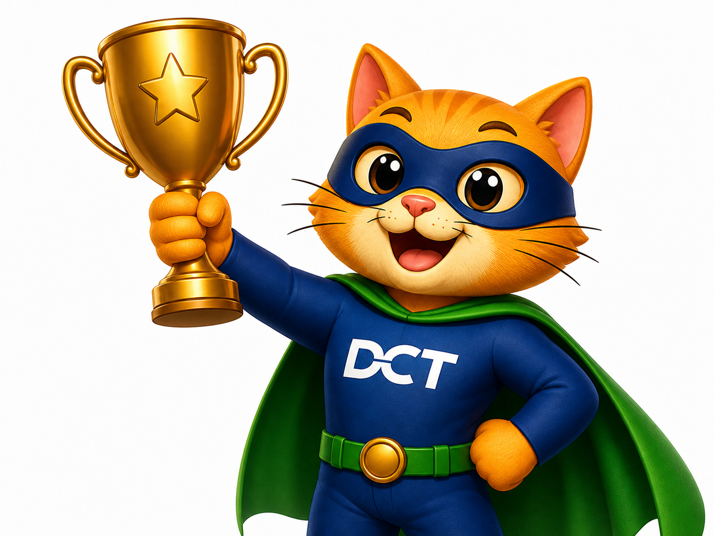

# Innovation Portfolio

## Overview

This portfolio documents the AI-powered platforms, automation frameworks, governance models, and delivery enablement solutions developed to support DCT delivery excellence, onboarding, quality, and innovation.

---
## Mission

Transform DCT delivery knowledge, governance, and operational processes into reusable AI-powered capabilities that accelerate onboarding, improve delivery consistency, reduce dependency on tribal knowledge, and improve delivery quality.

## Ownership

Portfolio Owner: Jenniver Stafford
Role: Senior Business Analyst, DCT
Organization: Center for Advanced Tax Technology (CATT)

Status: Active
Last Updated: June 2026

### DCT AI Innovation Portfolio

| Agent | Purpose | Status |
|---------|---------|---------|
| Ask Buddy | Business Analysis & Knowledge Assistant | Operational |
| QA Buddy | QA Readiness & Test Strategy Assistant | Planned |
| Release Buddy | Release Readiness & Sprint Analytics Assistant | Planned |
| Executive Buddy | Executive Reporting & Portfolio Insights Assistant | Planned |

## Portfolio Roadmap

Current Focus:
- Ask Buddy (Operational)

Next Planned Agents:
- QA Buddy
- Release Buddy
- Executive Buddy

Long-Term Vision:
Create an integrated ecosystem of AI assistants supporting business analysis, quality engineering, release management, governance, onboarding, and executive reporting across the DCT platform.

## Ask Buddy

### Description

Ask Buddy is an AI-powered Business Analysis assistant designed to transform DCT documentation into conversational knowledge. It provides guidance on architecture, APIs, governance models, onboarding, delivery status, and platform ownership.

### Capabilities

- Architecture Q&A
- API Guidance
- Delivery Status
- Governance Questions
- Onboarding Support
- Batch Delivery Insights
- Roger / PDC / TDC Integration Guidance

### Business Value

Ask Buddy transforms static documentation into an intelligent knowledge platform that accelerates onboarding, reduces dependency on tribal knowledge, improves delivery consistency, and provides instant access to DCT architecture and governance guidance.

### Current Status

- Operational within the DCT Delivery Model platform
- Integrated with GitHub knowledge repositories
- Supports architecture, governance, onboarding, API guidance, and delivery insights
- Continuously updated through repository-based documentation management

---
### Future Enhancements

- Story generation assistance
- Acceptance criteria recommendations
- QA readiness reviews
- Architecture impact analysis
- Sprint planning support
- Automated meeting recap generation
- Sprint health and delivery analytics

## QA Test Plan Review Agent

Description:
AI-powered QA governance review platform.

Capabilities:
- Test Plan Reviews
- Test Case Analysis
- Coverage Assessment
- Gap Detection

Business Value:
Accelerates QA readiness and improves governance compliance.

---

# Simulators

## Interactive Delivery Simulator

Description:
Users upload Trial Balances, Workbooks, or source files.

Capabilities:
- Data Flow Visualization
- Architecture Walkthrough
- End-to-End Process Education
- Real-Time Guidance

Business Value:
Converts architecture into an interactive learning experience.
